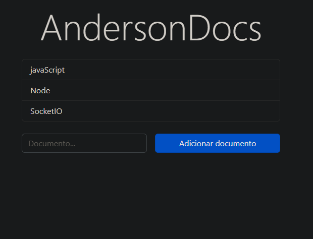

# AndersonDocs | Documento

## Descrição

Este é um documento sem título que permite aos usuários colaborarem em tempo real. O documento é exibido em uma página web interativa onde os usuários podem editar o texto e ver os usuários conectados.

## Funcionalidades

- Edição colaborativa em tempo real.
- Exibição de usuários conectados.
- Opção para excluir o documento.

##  Tecnologias Utilizadas
HTML
CSS (Bootstrap 5.2.2)
JavaScript
### Dotenv:
 O dotenv é um módulo que permite carregar variáveis de ambiente de um arquivo .env em seu aplicativo. Ele simplifica a configuração de variáveis de ambiente, como chaves de API ou informações de conexão com banco de dados, fornecendo um arquivo separado para armazenar essas configurações. Isso facilita a configuração e a proteção de informações sensíveis.

### Express:
 O Express é um framework web para Node.js que simplifica o processo de criação de aplicativos web. Ele fornece um conjunto de recursos e utilitários que facilitam a criação de APIs, gerenciamento de rotas, manipulação de solicitações e respostas, além de permitir a criação de middlewares para estender as funcionalidades do aplicativo.

##  Jsonwebtoken: 
O jsonwebtoken é uma biblioteca que permite a criação e verificação de tokens de autenticação baseados em JSON Web Tokens (JWT). Com ela, você pode gerar tokens criptografados que contêm informações do usuário, como ID ou permissões, para autenticação e autorização em sua aplicação.

## mongodb:
 O MongoDB é um banco de dados NoSQL orientado a documentos que oferece alta flexibilidade e escalabilidade. Ele armazena dados em formato JSON-like chamado BSON e permite que você modele seus dados de forma mais livre e dinâmica em comparação com bancos de dados relacionais tradicionais. O MongoDB é amplamente utilizado em aplicativos web e é conhecido por sua capacidade de lidar com grandes volumes de dados.

## Socket.io: 
O Socket.IO é uma biblioteca JavaScript que permite a comunicação bidirecional em tempo real entre clientes e servidores. Ela facilita a criação de aplicativos com recursos como chat em tempo real, colaboração em tempo real e atualizações em tempo real. O Socket.IO suporta diversos protocolos de comunicação, incluindo WebSockets, e oferece uma API simples e intuitiva para lidar com eventos e mensagens entre os clientes e o servidor.
Contribuição
Contribuições são bem-vindas! Sinta-se à vontade para abrir uma issue ou enviar um pull request.